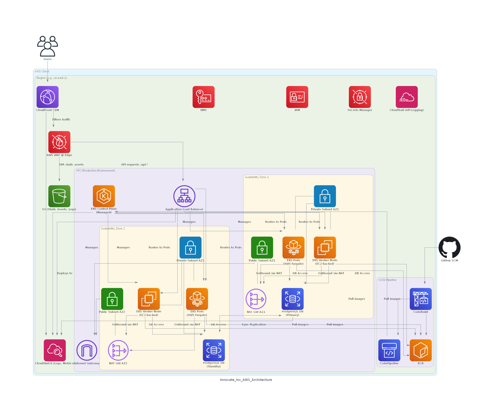

# Innovate Inc. - Cloud Architecture Design (AWS)

This document outlines the proposed cloud architecture for Innovate Inc.'s web application, hosted on Amazon Web Services (AWS). The design prioritizes scalability, security, resilience, and cost-effectiveness, leveraging managed services and Kubernetes. It also aims to adhere to the principles of the AWS Well-Architected Framework, with a strong emphasis on Operational Excellence and Security by Design.

## High-Level Architecture Diagram

## 1. Cloud Environment Structure (AWS Account Strategy)

A multi-account AWS strategy is recommended to provide strong isolation, granular security control, simplified billing, and better resource organization. This approach aligns with AWS best practices and facilitates a defense-in-depth security posture.

We recommend the following AWS accounts within an AWS Organization:

1.  **Management Account (Root)**:
    *   **Purpose**: Hosts AWS Organizations, consolidated billing, central security services (e.g., AWS GuardDuty master, Security Hub master, IAM Identity Center for SSO), and IAM user/role management for cross-account access using permission sets.
    *   **Key Services**: AWS Organizations, AWS IAM Identity Center (formerly AWS SSO), AWS Cost Explorer, AWS Control Tower (for landing zone governance).
    *   **Security Note**: Extremely limited human access. Primarily for Organization-level tasks and break-glass scenarios. All actions logged via CloudTrail to a central, immutable S3 bucket in a dedicated Log Archive account (see below).

2.  **Log Archive Account**:
    *   **Purpose**: Centralizes immutable logs from all other accounts. This includes CloudTrail, Config logs, VPC Flow Logs, EKS audit logs, application logs, etc.
    *   **Key Services**: S3 (with object lock and versioning for immutability), IAM (strict, write-once policies for other accounts to send logs).
    *   **Security Note**: Access to this account should be extremely restricted, primarily for automated systems and security/audit personnel during investigations.

3.  **Security Tooling Account (Audit Account)**:
    *   **Purpose**: Hosts centralized security services that operate across the organization. This account has read-only access to other accounts for auditing and monitoring.
    *   **Key Services**: Amazon GuardDuty (member account detector), AWS Security Hub (member account aggregator), Amazon Inspector, custom audit scripts, third-party security tools, SIEM integration points.
    *   **Security Note**: Enables separation of duties; security operations are managed from this account, distinct from workload accounts.

4.  **Shared Services Account**:
    *   **Purpose**: Centralizes shared infrastructure services such as networking resources (e.g., Transit Gateway, shared VPCs if applicable), Direct Connect, CI/CD infrastructure (e.g., central ECR, self-hosted GitHub runners or Jenkins agents if not using AWS CodeBuild directly in workload accounts), and potentially a centralized secrets management solution (e.g., HashiCorp Vault cluster if not solely relying on AWS Secrets Manager per account).
    *   **Key Services**: VPC, Transit Gateway, AWS PrivateLink, ECR, AWS CodeArtifact, self-hosted CI/CD tools, potentially GitHub Enterprise Server if self-hosting SCM.

5.  **Development (Dev) Account**:
    *   **Purpose**: Dedicated environment for developers to build, experiment, and test new features.
    *   **Isolation**: Completely isolated from staging and production environments.
    *   **Cost**: Can utilize smaller instance types and fewer resources to manage costs. Developer access should be scoped to their needs, with guardrails (Service Control Policies - SCPs) to prevent accidental deployment of overly expensive or insecure resources.
    *   **Security Note**: While more permissive than staging/prod, still enforce basic security hygiene (e.g., no public S3 buckets by default, mandatory IAM Roles for EC2/EKS). Regular automated security checks.

6.  **Staging Account**:
    *   **Purpose**: Pre-production environment that mirrors the production setup as closely as possible. Used for final testing, performance validation, and user acceptance testing (UAT) before deploying to production.
    *   **Isolation**: Isolated from development and production. Should closely mirror production security configurations.
    *   **Security Note**: Full security scanning (SAST, DAST, IAST, vulnerability scanning) applied here. Penetration testing may target this environment.

7.  **Production (Prod) Account**:
    *   **Purpose**: Hosts the live application accessible by end-users.
    *   **Security & Resilience**: Highest level of security controls, monitoring, and high-availability configurations.
    *   **Access**: Strictly controlled access via IAM Identity Center permission sets with time-bound credentials and least-privilege principles. All changes via approved CI/CD pipelines or audited break-glass procedures.
    *   **Security Note**: Highest level of monitoring, alerting, and preventative controls. Regular compliance checks and audits.

**Justification**:
*   **Security Isolation & Blast Radius Reduction**: Limits the impact of a security compromise. A breach in a Dev account is less likely to affect Prod.
*   **Centralized Security Governance**: Security Tooling and Log Archive accounts enable centralized monitoring, auditing, and incident response.
*   **Billing & Cost Management**: Clear separation of costs.
*   **Resource & Policy Scoping**: Easier to apply tailored security policies (SCPs, IAM policies) and resource quotas per environment.
*   **Scalability & Agility**: Supports independent team operations within their accounts while maintaining central governance.

## 2. Network Design

Each environment (Dev, Staging, Prod) will have its own Virtual Private Cloud (VPC) to ensure complete network isolation. Transit Gateway in the Shared Services account will be used for inter-VPC communication if necessary (e.g., Dev tools accessing shared resources), with strict routing and security group enforcement.

**VPC Architecture (per environment)**:

*   **Region**: Deploy resources in a primary AWS Region (e.g., us-east-1, eu-west-2) based on user proximity and service availability.
*   **Availability Zones (AZs)**: Utilize at least two, preferably three, AZs for high availability and fault tolerance.
*   **Subnets**:
    *   **Public Subnets**:
        *   Purpose: For internet-facing resources like Application Load Balancers (ALBs) and NAT Gateways.
        *   Routing: Route table directs internet-bound traffic through an Internet Gateway (IGW).
    *   **Private Subnets**:
        *   Purpose: For application resources like EKS worker nodes and RDS database instances. These resources should not be directly accessible from the internet.
        *   Routing:
            *   Internal traffic stays within the VPC.
            *   Outbound internet access (e.g., for pulling dependencies, OS updates) is routed through NAT Gateways located in the public subnets.
            *   Consider AWS PrivateLink endpoints for accessing AWS services (e.g., ECR, S3, CloudWatch, KMS, Secrets Manager) privately without needing NAT Gateways or IGW access for these services. This significantly enhances security by keeping traffic off the public internet and simplifies Security Group rules.
*   **IP Addressing**: Plan CIDR blocks carefully to avoid overlap and allow for future expansion and Transit Gateway routing. Use non-overlapping RFC1918 address space.
*   **DNS Resolution**: Utilize Amazon Route 53 Private Hosted Zones for internal DNS resolution within and across VPCs (if connected via Transit Gateway). Public DNS will point to CloudFront.

**Network Security (Defense in Depth)**:

*   **Amazon CloudFront & AWS WAF (Primary Edge Security)**:
    *   **Amazon CloudFront**: Will serve as the primary entry point for all user traffic.
        *   **Origins**: Configure CloudFront with multiple origins: an S3 bucket for the static React SPA frontend and the Application Load Balancer for the API backend (e.g., `/api/*` path pattern).
        *   **Caching**: Optimize caching behaviors for static assets to improve performance and reduce origin load. Set appropriate TTLs.
        *   **Security**: Enforce HTTPS, use modern TLS policies, Origin Access Identity (OAI) or Origin Access Control (OAC) for S3 to restrict direct S3 access.
    *   **AWS WAF**: Deploy primarily with Amazon CloudFront to inspect incoming traffic at the edge.
        *   Use AWS Managed Rules (e.g., Core rule set, Amazon IP reputation list, known bad inputs, Anonymous IP List, Bot Control).
        *   Develop custom rules based on application-specific threats and logging.
        *   Integrate WAF logs with a SIEM for analysis and alerting (sent to central Log Archive).
        *   Implement rate-based rules to mitigate DDoS and brute-force attacks.
    *   **AWS Shield Advanced**: Strongly consider for the Production distribution (CloudFront) for enhanced DDoS protection, 24/7 DDoS response team support, and cost protection.
*   **Application Load Balancer (ALB) Security**:
    *   The ALB will receive traffic only from CloudFront for API requests. Security Groups will be configured to allow traffic only from CloudFront IP ranges (or a managed prefix list for CloudFront).
    *   WAF can optionally be enabled on the ALB as a second layer of defense, but primary WAF rules will be on CloudFront.
*   **Security Groups (SGs)**:
    *   Act as stateful virtual firewalls at the resource level (ENIs: EC2 instances, EKS nodes, RDS instances, ALBs, Lambda functions within VPC).
    *   Implement a "zero-trust" and least-privilege model: By default, deny all traffic. Only allow necessary ports and protocols from specific, known sources (e.g., other SGs).
    *   Regularly audit and automate the review of SG rules to remove unused or overly permissive rules. Tools like AWS Firewall Manager can help manage SGs centrally.
*   **Network Access Control Lists (NACLs)**:
    *   Act as stateless firewalls at the subnet level.
    *   Use NACLs for broad, explicit deny rules (e.g., blocking known malicious IP ranges sourced from threat intelligence feeds) and as a secondary defense layer. Keep NACL rules simple and avoid overly complex configurations.
*   **AWS Network Firewall**:
    *   Consider for more advanced L3-L7 traffic inspection and filtering requirements within the VPC, offering more granular control than SGs/NACLs, including intrusion prevention (IPS) capabilities. Deploy centrally or per VPC as needed.
*   **VPC Flow Logs**:
    *   Enable for all VPCs. Send logs to the central Log Archive account (S3 bucket) and analyze them using Amazon Athena, CloudWatch Logs Insights, or a SIEM for traffic analysis, anomaly detection, and incident investigation.
*   **Secrets Management**:
    *   **AWS Secrets Manager**: Primary choice for managing secrets (API keys, database credentials, certificates).
        *   Enable automatic rotation for supported services (e.g., RDS credentials).
        *   Integrate with IAM for fine-grained access control to secrets.
        *   Replicate secrets cross-region for DR if necessary.
    *   **HashiCorp Vault**: If more advanced secrets management features (e.g., dynamic secrets for a wider range of backends, advanced encryption/tokenization) are needed, consider a self-managed Vault cluster in the Shared Services account, secured appropriately.
*   **VPC Endpoints (PrivateLink)**:
    *   Use Gateway Endpoints (for S3, DynamoDB) and Interface Endpoints (for most other services like ECR, API Gateway, KMS, CloudWatch Logs, etc.) to ensure private connectivity to AWS services without traversing the internet. This reduces data exfiltration risks and can lower data transfer costs.
    *   Apply endpoint policies to restrict access to specific resources.

## 3. Compute Platform (Amazon EKS)

Amazon Elastic Kubernetes Service (EKS) will be used to deploy, manage, and scale the containerized application, with security integrated at all layers.

*   **EKS Cluster**:
    *   Managed Control Plane: AWS manages the Kubernetes control plane. Ensure control plane logs (API server, authenticator, scheduler, controller manager) are enabled and sent to the central Log Archive account via CloudWatch Logs.
    *   **Endpoint Access**: Configure EKS cluster endpoint access to be private, or use a combination of public endpoint with strict CIDR whitelisting for authorized administrative access (e.g., from corporate network, bastion hosts).
    *   **Version Management**: Keep the EKS cluster and its components (kubelet, kube-proxy, CoreDNS) updated to the latest stable and supported Kubernetes versions to patch vulnerabilities.
    *   **Secrets Encryption**: Enable KMS encryption for Kubernetes secrets at rest within etcd.
*   **Node Groups (Security Hardening)**:
    *   **Amazon EKS Managed Node Groups / Karpenter**: Utilize these for simplified node management.
        *   **Custom AMIs**: Use custom Amazon Machine Images (AMIs) for EKS worker nodes, hardened according to CIS Benchmarks or internal security standards. Regularly update and patch these AMIs.
        *   **IAM Roles for Nodes**: Assign a unique IAM role to each node group with least-privilege permissions (e.g., permissions to pull images from ECR, write logs to CloudWatch, and necessary EKS permissions).
        *   **Instance Metadata Service (IMDSv2)**: Enforce IMDSv2 on worker nodes to protect against SSRF vulnerabilities.
        *   **Runtime Security**: Implement runtime security monitoring on nodes using tools like Falco, Aqua Security, or Sysdig to detect anomalous behavior and potential intrusions. Consider AWS GuardDuty for EKS runtime monitoring.
        *   **Compute Options**: While EC2-based worker nodes (via Managed Node Groups or Karpenter) provide maximum flexibility and are suitable for sustained workloads, consider **AWS Fargate for EKS** for specific use cases such as:
            *   Stateless applications with spiky or unpredictable load.
            *   Batch processing jobs.
            *   Development/test environments where eliminating node management simplifies operations.
            Fargate allows running pods without managing the underlying EC2 instances, trading some control for operational simplicity.
        *   **Instance Types**: Use a mix of EC2 instance types. Consider Graviton for price-performance. Ensure instances chosen have up-to-date CPU microcode.
        *   **Spot Instances**: Use with caution for production workloads. If used, ensure the application is truly fault-tolerant and that Karpenter/Cluster Autoscaler can quickly replace them. Limit use for security-sensitive components if possible.
*   **Scaling**:
    *   **Horizontal Pod Autoscaler (HPA)**: Scale pods based on metrics.
    *   **Cluster Autoscaler / Karpenter**: Scale nodes. Ensure scaling policies are tuned to prevent resource exhaustion while optimizing costs.
*   **Resource Allocation & Isolation (Kubernetes Native)**:
    *   **Requests and Limits**: Define CPU and memory requests and limits for all containers to prevent resource contention and DoS within the cluster.
    *   **Namespaces**: Use namespaces for logical separation of application components, teams, or environments within a single cluster (if applicable). Apply ResourceQuotas and LimitRanges per namespace.
    *   **Network Policies**: Implement Kubernetes Network Policies to control pod-to-pod communication (east-west traffic) within the cluster. By default, deny all inter-pod communication and explicitly allow required flows. Use a CNI plugin that supports Network Policies (e.g., Amazon VPC CNI with Calico, or standalone Calico/Cilium).
    *   **Pod Security Admission (PSA) / Pod Security Policies (PSP - deprecated but concept is valid)**:
        *   Enforce Pod Security Standards (e.g., `baseline` or `restricted`) using Pod Security Admission controllers or integrate OPA/Gatekeeper for more granular policy enforcement.
        *   Prevent privileged containers, hostPath mounts, host networking, etc., unless absolutely necessary and tightly controlled.
    *   **Service Accounts**: Use dedicated Kubernetes service accounts for each application/pod with least-privilege RBAC roles. Disable default service account token automounting where not needed (`automountServiceAccountToken: false`).
    *   **IAM Roles for Service Accounts (IRSA)**: Leverage IRSA to assign fine-grained AWS IAM permissions directly to Kubernetes pods, eliminating the need for worker nodes to have broad permissions.
*   **Containerization Strategy (Secure Images & Registry)**:
    *   **Image Building (Secure SDLC)**:
        *   Use minimal, hardened base images (e.g., distroless, Alpine, or company-approved base images).
        *   Perform multi-stage builds to reduce image size and attack surface.
        *   Avoid embedding secrets in images; fetch them at runtime from AWS Secrets Manager using IRSA.
        *   Scan images for vulnerabilities using Amazon ECR Scanning (powered by Clair/Trivy) or integrate third-party scanners (e.g., Trivy, Snyk, Aqua) into the CI/CD pipeline. Fail builds on high/critical vulnerabilities.
        *   Implement image signing using tools like Notary or Cosign to ensure image integrity and provenance.
    *   **Image Registry (Amazon ECR)**:
        *   Store images in ECR. Use repository policies to restrict push/pull access.
        *   Enable ECR lifecycle policies to manage old/untagged images.
        *   Replicate ECR repositories to other regions for DR if necessary.
    *   **Deployment Process (Secure CI/CD)**:
        *   **Source Control**: GitHub is recommended. GitLab or other Git-based platforms are also suitable alternatives.
        *   **Build**: AWS CodeBuild to compile code, run tests, and build Docker images.
        *   **Store**: Push built images to Amazon ECR.
        *   **Deploy**:
            *   AWS CodePipeline to orchestrate the CI/CD workflow.
            *   Deployment to EKS can be managed using:
                *   **Helm**: Package manager for Kubernetes, simplifying deployment and management of applications.
                *   **Kustomize**: Template-free way to customize application configuration.
                *   **GitOps tools (Argo CD / Flux)**: Highly recommended for declarative, auditable, and secure deployments. Ensure Git repository access controls are tight and changes go through PRs and approvals.
        *   **Deployment Strategies**: Use Blue/Green or Canary deployments, with automated rollbacks based on health checks and security alerts.
        *   **Admission Controllers**: Utilize validating and mutating admission webhooks (e.g., with OPA/Gatekeeper, Kyverno) to enforce custom security policies before resources are created in the cluster.

## 4. Database (Amazon RDS for PostgreSQL)

For the PostgreSQL database, Amazon Relational Database Service (RDS) for PostgreSQL is recommended as the initial choice, with robust security configurations and a clear path to Amazon Aurora for future scalability.

*   **Service Choice Rationale (RDS for PostgreSQL Initially)**:
    *   **Cost-Effectiveness at Startup Scale**: For Innovate Inc.'s initial low load, RDS for PostgreSQL (e.g., a `db.t3` or `db.t4g` series instance in Multi-AZ) typically offers a lower and more predictable starting cost compared to Aurora, whose I/O pricing model becomes more advantageous at higher throughput.
    *   **Simplicity and Standard PostgreSQL**: RDS provides standard PostgreSQL, making it straightforward for teams familiar with PostgreSQL. Its management interface is well-established.
    *   **Sufficient for Initial Requirements**: It delivers all necessary features for the application: ACID compliance, robust security, automated backups, and high availability (Multi-AZ).
    *   **Mature Service**: RDS for PostgreSQL is a highly mature and stable offering.

*   **Future Upgrade Path to Amazon Aurora (PostgreSQL-Compatible)**:
    *   As Innovate Inc. anticipates rapid growth to millions of users, migrating to Amazon Aurora PostgreSQL-Compatible Edition is the recommended strategy when:
        *   Database I/O performance becomes a limiting factor.
        *   Need for more extensive read replica scaling (up to 15 Aurora Replicas).
        *   Requirements for even faster failover times or features like Aurora Global Database for multi-region DR/active-active.
        *   Workloads become highly variable, making Aurora Serverless v2 an attractive option.
    *   AWS provides well-documented migration paths from RDS PostgreSQL to Aurora PostgreSQL.

*   **Service Choice (Current)**: Amazon RDS for PostgreSQL.
*   **Justification (for RDS Features)**:
    *   **Managed Service**: AWS handles provisioning, patching, backups, recovery, and scaling, reducing operational burden.
    *   **High Availability**: Built-in Multi-AZ deployment option.
    *   **Scalability**: Easy to scale compute and storage. Monitor and scale proactively.
    *   **Security**: Offers encryption at rest and in transit, network isolation via private subnets and security groups, and IAM integration.
*   **Backups**:
    *   **Automated Backups**: Enable automated daily snapshots with a configurable retention period (e.g., 7-35 days). Store these backups encrypted using a customer-managed KMS key (CMK).
    *   **Manual Snapshots**: Take manual snapshots (also encrypted) before major changes. Limit permissions for snapshot deletion.
    *   **Cross-Region Backups**: Encrypted copies of snapshots should be sent to a DR region for disaster recovery.
    *   **Point-In-Time Recovery (PITR)**: Ensure this is enabled and tested.
*   **High Availability (HA)**:
    *   **Multi-AZ Deployment**: Configure the RDS instance for Multi-AZ. RDS will synchronously replicate data to a standby instance in a different AZ. In case of a primary instance failure or AZ outage, RDS automatically fails over to the standby instance.
*   **Disaster Recovery (DR)**:
    *   **Cross-Region Read Replicas or Global Databases**: For lower RTO/RPO, use Cross-Region Read Replicas that can be promoted, or consider Amazon Aurora Global Database if migrating to Aurora PostgreSQL-Compatible Edition for more seamless global failover.
    *   **Restore from Snapshots**: Ensure the process of restoring from encrypted cross-region snapshots is documented and regularly tested.
*   **Security**:
    *   **Encryption**:
        *   Enable encryption at rest using AWS Key Management Service (KMS).
        *   Enforce SSL/TLS for encryption in transit.
    *   **Network Isolation**: Deploy RDS instances in dedicated private subnets with no direct internet access. Use Security Groups allowing access only from specific application tier Security Groups on the PostgreSQL port.
    *   **Access Control**:
        *   Use strong, unique database credentials managed by AWS Secrets Manager with automatic rotation enabled and configured.
        *   **IAM Database Authentication**: Strongly recommended. This allows authentication to the database using IAM users and roles, providing centralized access control and leveraging IAM's security features (MFA, short-lived credentials). Avoid using native database users where possible.
        *   Regularly audit database user privileges if native users are unavoidable.
*   **Performance & Monitoring**:
    *   Use Amazon CloudWatch metrics, Enhanced Monitoring, and Performance Insights.
    *   **Database Activity Streams**: Consider for near real-time auditing of database activity, sending logs to CloudWatch and then to the central Log Archive account.
    *   Log all DDL/DML changes and audit failed/successful logins.

## 5. CI/CD Pipeline (Secure Software Development Lifecycle - SSDLC)

A robust and secure CI/CD pipeline is crucial. Security checks should be integrated at every stage.

*   **Source Code Management (SCM)**: GitHub is recommended. GitLab or other Git-based platforms are also suitable alternatives.
    *   **Repository Structure**: Organize repositories logically (e.g., per microservice, frontend, backend, IaC).
    *   **Branch Protection Rules**: Enforce PR reviews, status checks (passing tests, scans), and signed commits on main branches.
    *   **Code Scanning (SAST)**: Integrate Static Application Security Testing (SAST) tools (e.g., SonarQube, Checkmarx, GitHub Advanced Security) to scan code for vulnerabilities on every commit/PR.
    *   **Dependency Scanning**: Scan for known vulnerabilities in third-party libraries (e.g., OWASP Dependency-Check, Snyk, GitHub Dependabot). Update vulnerable dependencies promptly.
    *   **Secrets Scanning**: Implement tools to detect and prevent secrets (API keys, passwords) from being committed to repositories (e.g., git-secrets, TruffleHog, GitHub secret scanning).
*   **Build & Test**: AWS CodeBuild (integrates well with GitHub) or Jenkins/GitLab CI.
    *   **Secure Build Environment**: Ensure build environments are ephemeral and hardened.
    *   **Unit/Integration Tests**: Comprehensive tests to ensure functionality and catch regressions.
    *   **Frontend Build**: Build the React SPA.
    *   **Backend Build**: Build the Python/Flask API.
    *   **Dynamic Application Security Testing (DAST)**: Integrate DAST tools (e.g., OWASP ZAP, Burp Suite) to scan running applications in staging environments for vulnerabilities.
    *   **Interactive Application Security Testing (IAST)**: Consider IAST tools that instrument the application to identify vulnerabilities during runtime tests.
    *   **Infrastructure as Code (IaC) Scanning**: Scan IaC templates (CloudFormation, Terraform) for misconfigurations using tools like `cfn-lint`, `tfsec`, Checkov.
    *   **Container Image Building**: As detailed in EKS section (hardened base images, multi-stage builds, no embedded secrets).
*   **Artifact Repository**: Amazon ECR for Docker images. Amazon S3/CodeArtifact for other artifacts.
    *   **Image Vulnerability Scanning**: Scan images in ECR (or during build phase) and block deployments of images with critical/high vulnerabilities.
    *   **Image Signing & Verification**: Ensure images are signed, and that EKS only deploys signed images from trusted registries.
    *   **SPA Static Assets**: Store built frontend assets (HTML, JS, CSS, images) in an S3 bucket configured for static website hosting, which will serve as an origin for CloudFront.
*   **Deployment**: AWS CodePipeline with CodeDeploy or GitOps (Argo CD/Flux).
    *   **Frontend Deployment**: Deploy static assets to the S3 bucket and invalidate CloudFront cache.
    *   **Backend Deployment**: Deploy containerized API to EKS.
    *   **Least Privilege**: Deployment tools should have minimal necessary permissions to target environments, ideally via IAM roles.
    *   **Change Control**: All deployments to Staging and Production must be automated, auditable, and require approvals (manual or automated gates based on test/scan results).
    *   **Configuration Management**: Securely manage environment-specific configurations. Avoid hardcoding secrets.
    *   **Post-Deployment Verification**: Automated checks (health checks, smoke tests, security checks) after deployment.
    *   **Rollback Strategy**: Automated rollback capabilities in case of failures or security issues.
*   **Workflow Example (with Security Gates)**:
    1.  Developer pushes code to a feature branch in GitHub.
    2.  Pull request triggers:
        *   CodeBuild: SAST, dependency scan, IaC scan, build, unit tests.
        *   Secrets scan on pre-commit/pre-push hooks and in CI.
    3.  Upon PR merge to `main`/`develop` branch:
        *   CodeBuild: Builds Docker image, performs image vulnerability scan.
        *   Image pushed to ECR (and signed).
    4.  CodePipeline triggers deployment to Staging EKS cluster.
    5.  Automated DAST/IAST scans run against Staging. Penetration testing may occur here.
    6.  Security Gate: Approval required if high/critical vulnerabilities are found in any scan, or if tests fail. Manual approval for production promotion.
    7.  CodePipeline deploys to the Production EKS cluster using a safe deployment strategy (Blue/Green or Canary).

## 6. Security & Compliance

Security is a continuous process, integrated into the entire lifecycle (DevSecOps).

*   **IAM (Identity and Access Management)**:
    *   **Centralized Identity**: Use AWS IAM Identity Center (SSO) for human access, federated with a corporate IdP if available.
    *   **Least Privilege**: Rigorously enforce least privilege for all IAM users, groups, roles, and permission sets. Regularly review and prune unused permissions using IAM Access Analyzer.
    *   **MFA**: Enforce MFA for all human users, especially for access to Management, Security, and Production accounts.
    *   **IAM Roles**: Use IAM roles for all compute services (EC2, EKS nodes, Lambda) and for cross-account access. Avoid long-lived access keys.
    *   **Service Control Policies (SCPs)**: Use SCPs in AWS Organizations to set preventative guardrails across accounts (e.g., restrict regions, disable risky services, enforce tagging).
    *   **Regular Audits**: Periodically audit IAM configurations, roles, and policies.
*   **Data Protection**:
    *   **Encryption at Rest**: Enforce encryption for all supported services (S3, EBS, RDS, ECR, etc.) using AWS KMS with Customer Managed Keys (CMKs) where appropriate for granular control and auditing. Enable key rotation.
    *   **Encryption in Transit**: Enforce TLS 1.2+ for all communications. Use ACM for managing public TLS certificates.
    *   **Data Classification**: Classify data (e.g., sensitive, PII) and apply appropriate security controls based on classification.
    *   **Amazon Macie**: Consider for discovering and protecting sensitive data in S3.
*   **Threat Detection & Incident Response**:
    *   **Amazon GuardDuty**: Enable in all accounts, sending findings to the Security Tooling account. Integrate with alerting and automated response workflows.
    *   **AWS Security Hub**: Aggregate findings from GuardDuty, Inspector, Macie, IAM Access Analyzer, and third-party tools in the Security Tooling account. Use for compliance checks (e.g., CIS Benchmarks, PCI-DSS).
    *   **Amazon Inspector**: For vulnerability scanning of EC2 instances and container images in ECR.
    *   **AWS Config**: Enable in all accounts to continuously monitor and record resource configurations. Use conformance packs for compliance checking. Send data to the Log Archive and Security Tooling accounts.
    *   **Runtime Security Monitoring**: For EKS nodes and container workloads (e.g., GuardDuty for EKS, Falco).
    *   **SIEM Integration**: Forward relevant logs (CloudTrail, CloudWatch, VPC Flow Logs, GuardDuty/Security Hub findings, application security logs) from the Log Archive account to a SIEM (e.g., Amazon OpenSearch Service, Splunk) for advanced threat hunting and correlation.
    *   **Proactive Operational Insights with AIOps**: Enable **Amazon DevOps Guru** to automatically detect operational anomalies and provide actionable recommendations, integrating its findings into the overall monitoring and alerting strategy.
    *   **Incident Response Plan**: Develop and regularly test an incident response plan.
*   **Logging & Monitoring (Comprehensive & Centralized)**:
    *   **AWS CloudTrail**: Enabled in all accounts, logging to the central Log Archive S3 bucket with integrity validation.
    *   **Amazon CloudWatch**: Centralized logging for applications, EKS (control plane, audit logs), RDS, VPC Flow Logs (if not directly to S3). Set up critical alarms.
    *   **Application Performance Monitoring (APM)**: Tools like AWS X-Ray, Datadog, New Relic for tracing and performance insights, also can reveal security anomalies.
*   **Vulnerability Management (Continuous Process)**:
    *   **Infrastructure Vulnerability Scanning**: AWS Inspector for EC2, ECR scanning for containers.
    *   **Patch Management**: Automated or semi-automated patching for AMIs, EKS nodes, and third-party software.
    *   **Penetration Testing**: Conduct regular penetration tests by qualified third parties against Staging and Production environments.
    *   **Bug Bounty Program**: Consider for mature applications.
*   **Compliance & Auditing**:
    *   Leverage AWS Artifact for compliance reports (PCI, ISO, SOC).
    *   Use AWS Config rules and Security Hub for continuous compliance monitoring against frameworks like CIS, PCI DSS, NIST.
    *   Maintain an audit trail of all changes through CloudTrail and GitOps practices.

## 7. Cost Optimization

*   **Right-Sizing**: Continuously monitor and adjust instance sizes for EKS nodes, RDS, and other resources based on actual utilization. This also contributes to the **Sustainability** pillar of the AWS Well-Architected Framework by minimizing resource waste.
*   **Reserved Instances/Savings Plans**: For predictable workloads (e.g., core EKS nodes, RDS instance), consider Reserved Instances or Savings Plans to significantly reduce costs compared to On-Demand pricing.
*   **Spot Instances**: Leverage EC2 Spot Instances for EKS worker nodes where appropriate (fault-tolerant workloads) for substantial cost savings. Karpenter can help manage Spot instances effectively.
*   **Autoscaling**: Implement autoscaling for EKS nodes and pods to match capacity with demand, avoiding over-provisioning.
*   **Storage Tiering**: Use appropriate S3 storage classes (e.g., S3 Intelligent-Tiering, Glacier for archives).
*   **Data Transfer Costs**: Be mindful of data transfer costs between AZs and out to the internet. Use PrivateLink where possible for inter-service communication within AWS.
*   **Budgeting & Tagging**: Use AWS Budgets to set spending limits and alerts. Implement a comprehensive tagging strategy for all resources to track costs by project, environment, or team.
*   **Metrics Collection**: Beyond standard CloudWatch metrics, instrument applications with **OpenTelemetry (OTel)** SDKs (e.g., using AWS Distro for OpenTelemetry - ADOT) for standardized metrics, traces, and logs. This allows flexibility in choosing observability backends (CloudWatch, AWS X-Ray, Prometheus, Grafana, etc.). Consider integrating Prometheus & Grafana (or Amazon Managed Services for them) for deeper EKS and application-specific monitoring.

## 8. Operational Excellence Considerations

Beyond the service-specific configurations, the following Operational Excellence principles are key to the long-term success and manageability of this architecture:

*   **Infrastructure as Code (IaC)**: All AWS infrastructure (VPCs, EKS clusters, IAM roles, Security Groups, RDS instances, CloudFront distributions, etc.) will be defined and managed using an IaC framework (e.g., AWS CloudFormation or HashiCorp Terraform). All IaC templates will be version-controlled in GitHub and deployed via automated CI/CD pipelines. This ensures repeatability, consistency, auditability, and facilitates disaster recovery.
*   **Unified Observability**: A comprehensive observability strategy will be implemented, correlating logs, metrics, and traces across all layers of the application and infrastructure. This includes:
    *   **Centralized Logging**: As detailed, all logs (CloudTrail, VPC Flow Logs, EKS audit/control plane/application logs, RDS logs, WAF logs, etc.) will be sent to the central Log Archive account.
    *   **Metrics Collection**: Beyond standard CloudWatch metrics, consider integrating Prometheus & Grafana (or Amazon Managed Services for them) for deeper EKS and application-specific monitoring.
    *   **Distributed Tracing**: Implement distributed tracing (e.g., AWS X-Ray, Jaeger) across microservices and API calls to understand request flows and pinpoint performance issues.
*   **Automation**: Automate as much as possible, including deployments, testing, security checks, configuration management, and common operational tasks (e.g., patching, backups).
*   **Runbooks and Playbooks**: Develop runbooks for routine operational procedures and playbooks for incident response to ensure consistent and efficient handling of events.
*   **Regular Reviews & Game Days**: Conduct regular architectural reviews, Well-Architected Framework Reviews (WAFR), and operational readiness reviews. Implement "Game Day" exercises (simulated failure or high-load scenarios) to test system resilience and operational responses.
*   **Change Management**: All changes to the production environment must go through a defined, auditable change management process, ideally integrated with the CI/CD pipeline and GitOps workflows.
*   **Documentation**: Maintain up-to-date documentation, including this architecture document, IaC templates, runbooks, and Architecture Decision Records (ADRs) to log key design choices and their rationale.

---

This architecture provides a solid foundation for Innovate Inc. It is designed to be scalable, secure, and resilient, allowing the startup to focus on application development while leveraging the power of AWS managed services. Regular reviews and adjustments to the architecture will be necessary as the application evolves and traffic grows. 